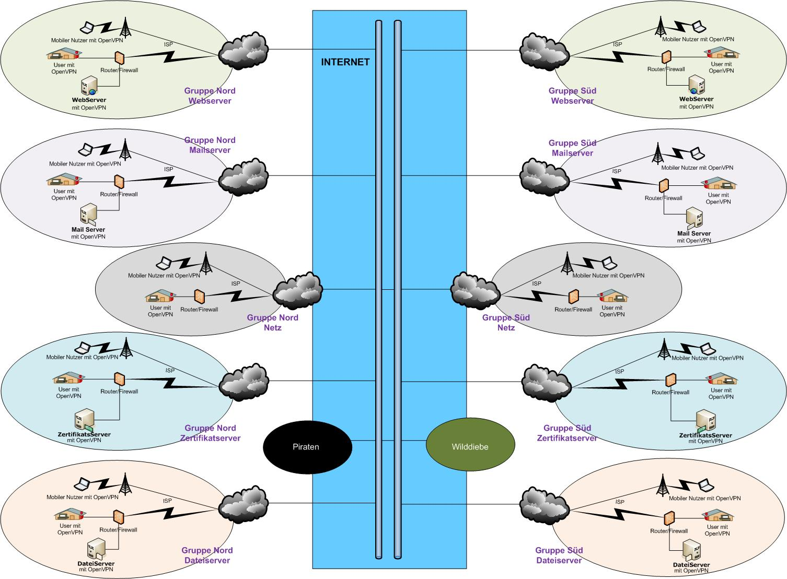

\newpage
\tableofcontents
\newpage

# Projekt Definition
## Aufgabenbeschreibung
Für das 'Fachpraktikum 1599 - Sicherheit im Internet' an der Fernuniversität
Hagen wurde als Aufgabenstellung folgendes Szenario definiert:

Zwei fiktive Firmen Mayer Brot(Region Nord) und Müller Backwaren(Region Süd)
haben fusioniert. Die daraus enstehenden Anforderungen, erzeugen auch für die
EDV Abteilungen unterschiedliche Aufgaben. Um diese Aufgaben abzudecken wurden
die Studenten je Firma in 5 Gruppen eingeteilt die sich selbstständig um die
enstandenen Kernpunkte kümmern. Die Gruppeneinteilung sieht auf beiden Seiten
eine Gruppe Netzwerk, CA, Mailserver, Webserver, Fileserver. Je Gruppenpaar
gibt es eine eigenständige Aufgabe welche pro Firma und Gruppe zu erledigen
ist.

In dieser Betrachtung liegt der Fokus auf der Gruppe __Fileserver__ aus der
__Region Süd__. Diese Gruppe (Gruppe 10 - Fileserver Süd) hat die
Aufgabenstellung innerhalb des, durch die Netzwerkgruppen definierten,
Netzwerkes einen Fileserver zur Verfügung zu stellen. Hier sollen neben einem
passwordgeschützem Bereich auch ein öffentlicher Bereich zur Verfügung gestellt
werden. Die Serversysteme sollen durch die Gruppen selbst bereitgestellt
werden. Die konkrete Realisierung ist innerhalb des gegebenen Rahmes frei so
das die Wahl der eingesetzten Software wie Betriebsystem, Fileserver oder
anderweitig verwendeter Komponenten in der Aufgabe der Teilnehmer liegt.

Der Anschluss, an das durch die Netzwerkgruppen bereitgestellten Netzwerks,
wird durch die Einwahl als VPN Client auf dem jeweiligen regionalen VPN-Server
realisiert. Hierzu ist eine intensive Abstimmung mit den Gruppen Netzwerk und
CA nötig da die Kommunikation über Zertifikate mit ensprechenden
Vertrauensverhältnissen sichergestellt werden soll.

## Ist-Zustand
## Ziele
## Universitätsmittel
Seitens der Universität werden zur Kommunikation eine [Newsgroup][1] und die
gesammelten E-Mailadressen zur Verfügung gestellt. Eine Bereitstellung von
Unterlagen oder Hard- und Software durch die Universität findet nicht statt und
muss vollumfänglich durch die Studenten zur Verfügung gestellt werden.

[1]: https://www.fernuni-hagen.de/www2news/thread.php?cluster=informatik-kurse.txt&group=feu.informatik.kurs.1599
## Dokumentation
## Personal
### Teilnehmer
* Silas Jansen
* Stefan Bruch
* Fabian Hofmann
* Thomas Grosswendt
* Sascha Girrulat

## Zeitplanung
__Bearbeitungszeitraum__: Mo-18-Jul-2016 bis So-28-Aug-2016

# Anforderungsanalyse und Planung
## Arbeitsweise
## Voraussetzungen
## Problemstellungen
## Kommunikation
Die Aufgabenstellungen der unterschiedlichen Gruppen erfordern eine Abstimming
der Kommunikationswege für die Gruppeninterne und -externe Kommunikation.

### Gruppenintern
Zur Kommunikation innerhalb der Gruppe wurde neben der Kommunikation über Mail
und Newsgroup auch ein Mumbleserver genutzt. Dieser ermöglicht eine
Platformunabhängige Anstimmung in Echtzeit. Dieser war zu Beginn des Projektes
bereits vorhanden und wurde durch ein Gruppenmitglied zur Verfügung gestellt.
Es gibt für alle gängigen Betriebsysteme einen Client. Die Registrierung
erfolgt nach erstmaliger Anmeldung. Die hierfür benötigten Zugangsdaten werden
auf Anfrage per Mail durch <sascha@girrulat.de> versand.

### Gruppenübergreifend
Mumble, Mail Gruppe 5
# Entwurf
## mögliche Lösungen
### Vergleich und Auswahl Server
### Vergleich und Auswahl Fileserver
## Benutzermodell
## Firewall
## Konfiguration
## Dokumentation

# Umsetzung
## Installation
### Server
### Software

## Dokumentation

# Test und Integration
## Integration in das Gruppennetzwerk
## Absprache mit anderen Gruppen
## Aufgetretene Probleme und Fehler

# Abschluss
## Soll-Ist-Vergleich
## Qualitätsicherung
## Übergabe /Abnahme
## Weiterführung und Folgeprojekte
### Sicherheit 
BSI Grundschutz?
### Betrieb
ITIL?
### Monitoring
Systemmonitoring? BI Monitoring?
### Rsyslog
Zentral?
### Backup/Restore
Sharing zwischen Gruppe 5 und 10?
## Fazit

\begin{figure}
  \caption{Dummy figure}
\end{figure}

| __Erforderliche Eigenschaften__ | Lösung A | Lösung B | Lösung C | Bemerkung |
|---------------------------------|:--------:|:--------:|:--------:|:---------:|
| Platformübergreifend            | x        |          |          |    (1)    |
| Gruppen-/Benutzerverwaltung     |          | x        |          |    (2)    |
|                                 |          |          |          |    (3)    |
|                                 |          |          |          |           |
|                                 |          |          |          |           |

Table:  Demonstration of a grid table syntax.

  Right     Left     Center     Default
-------     ------ ----------   -------
     12     12        12            12
    123     123       123          123
      1     1          1             1

Table:  Demonstration of simple table syntax.

\newpage
\listoftables
\newpage
\listoffigures
